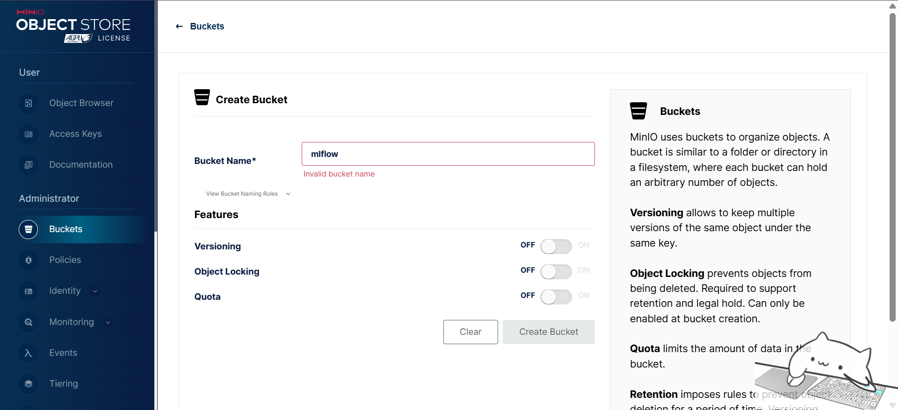
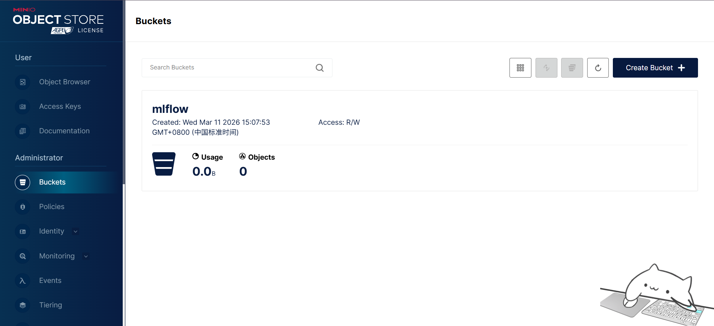

# 基于 K8s 部署 MLFlow

1. 创建 namespace
```bash
kubectl create namespace mlflow
```

2. 部署PgSQL
```bash
kubectl apply -f pgsql.yaml
```

3. 部署Minio
```bash
kubectl apply -f minio.yaml
```
4. 访问 http://minioIP:9001，使用上面设置的凭证登录，创建一个名为 mlflow 的 bucket



5. 创建 secret 存储敏感信息
```bash
kubectl apply -f mlflow-secret.yml
```
6. 创建 configmap 存储配置信息
```bash
kubectl apply -f mlflow-config.yml
```

7. 创建 deployment
```bash
kubectl apply -f mlflow-deploy.yml
```
8. 创建 service
```bash
kubectl apply -f mlflow-svc.yml